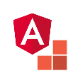

# angular-starter-kit
Starter kit for developing web apps with Code.Hub and Angular

## Recommended Setup

- Visual Studio Code (VSCode)
- Node.js
- npm
- Git

## Installation instructions

1. Download and install [VSCode](https://code.visualstudio.com/download) editor.
2. Download and install an **LTS** version of [Node.js](https://nodejs.org/). To verify that you have installed it succesfully type the command `node -v` in a command line window. If you have installed it correctly is should display the installed version of Node.js
3. **Npm** is already included in Node.js. To verify that you have it, type the command `npm -v` in a command line window. If it is installed correctly, tt should display the current npm version.
4. If you do not already have Git installed, navigate to https://git-scm.com/downloads, download the appropriate version for your environment and install it. 

